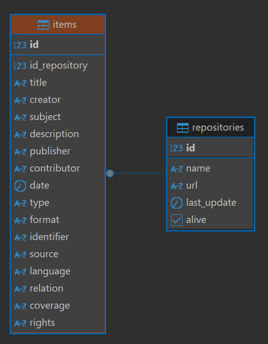

# CienciaMx

This repository contains scripts for collecting and analyzing data from numerous institutional repositories compiled 
from the [Repositorio Nacional](https://repositorionacionalcti.mx/).
The goal is to create a new repository borwser to replace the obsolete Repositorio Nacional.

---

## Install dependencies

```bash
py -m pip install -r requirements.txt
```


## Structure 

This is the structure of this repository

```
project/ 
│── data/                               # Contains all the input and output files
│   ├── input/
│   │   ├── csv/
│   ├── output/
│   │   ├── data/
│   │   ├── csv/
│── src/
│   ├── extraction/
│   │   ├── fetch_data.py               # Get all the data from the repositories and saves it in JSON format
│   │   ├── dspace_client.py            # A client for interacting with DSpace OAI-PMH API
│   ├── analytics/
│   │   ├── data_analizer:service.py    # Verifies the obligatory metadata fields
│   │   ├── metadata_validator.py       # Validates the metadata in 3 categories (obligatory, obligatory when applicable, recommended)
│   ├── db/                          
│   │   ├── db_connector.py             # Manage database connection
│   │   ├── insert_item_from_reposityory.py # Insert the items and reositories into de DB
│   │   ├── item_DTO.py                 # Dataclass for items table objects
│   │   ├── repository_DTO.py           # Dataclass for repositories table objects
│   ├── stats/
│   ├── others/
```
---

## Database 

### Database Diagram (Prototype)




### Database Connection

Create a `.env` file with the right database credentials in `src/query/`

**.env content:**
```
DB_HOST=localhost or host address
DB_PORT=5432
DB_NAMES=Database name
DB_USER=postgres or username
DB_PASS=secret password
```
